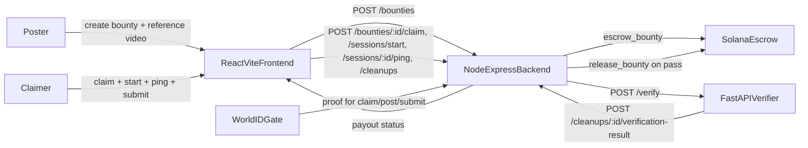
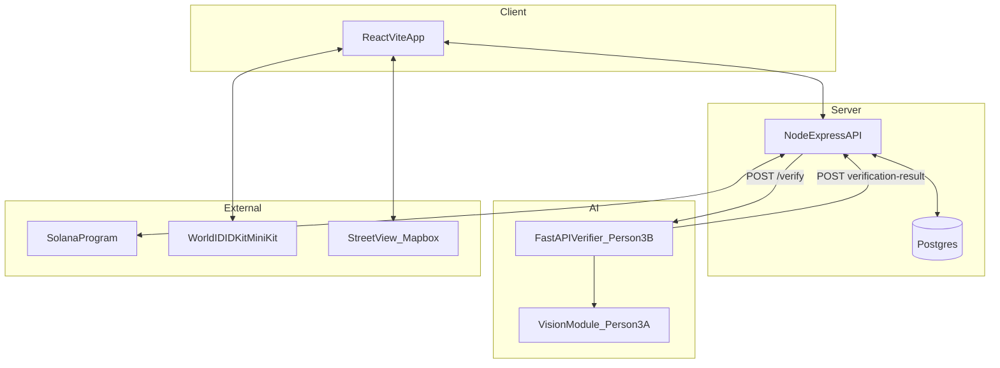
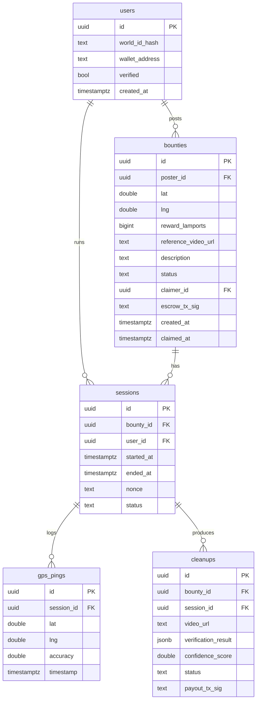
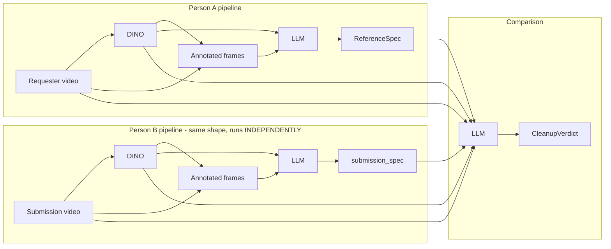

# Civic Bounty Marketplace — Full Design Specification

A geo-tagged civic-cleanup bounty marketplace. Organizations escrow Solana for cleanup work, anyone can claim and complete bounties, and AI verification releases instant payouts on completion.

**Hackathon tracks:** Sustain The Spark (environment) · World U (proof-of-human) · MLH Best Use of Solana

---

## 1. Thesis & value proposition

A bounty marketplace where organizations fund geo-tagged civic cleanup tasks (expandable to general service tasks later), anyone nearby can claim and complete them, and AI verifies the work before releasing instant Solana payouts.

We flip the gig economy toward social good: communities post the work, individuals earn micro-rewards for doing it, and Solana's near-zero fees make $5–$50 bounties economically viable for the first time. World ID guarantees one-human-one-account and AI verification removes the trust bottleneck, so funders know their money reaches real people doing real work.

## 2. Core features

- **Map-based bounty marketplace** — organizations drop a pin, record a reference 360 video, and escrow SOL/USDC; claimable bounties appear on a map filterable by reward, distance, and category.
- **One-tap task flow** — users press "Start Task" to begin a verified session, do the work, then record one 360 video at the end with a ghost-overlay matching the poster's framing.
- **Multi-layer verification** — continuous GPS trajectory, cell-tower cross-check, server-issued nonce watermark, and vision-model comparison against the poster's reference and Google Street View confirm both location and task completion.
- **World ID human gate** — every user verifies as a unique human before their first claim, blocking sockpuppet farming and giving funders confidence in the recipient.
- **Instant Solana payouts** — smart contract escrow releases the bounty the moment verification passes, with sub-cent fees that make small-dollar civic work actually pay.

---

## 3. End-to-end user flow

1. **Poster** drops a map pin, records a reference 360 video at the site, sets reward and description, escrows SOL into a smart contract.
2. **Claimer** browses the map, taps **Claim** on an open bounty (locks bounty for 4 hours).
3. **Claimer** travels to the location, taps **Start Task** — server issues a session token and a fresh nonce, app starts logging GPS every 10–15 s.
4. **Claimer** does the cleanup (phone in pocket is fine).
5. **Claimer** taps **Finish & Verify** — camera opens to a 360 capture UI with the poster's reference frame as a faded ghost overlay and the server nonce as a watermark.
6. **Claimer** records one 360 video and submits.
7. **Backend** queues the verification job and POSTs the bundle (videos, trajectory, nonce, duration) to the AI service.
8. **AI service** runs vision + fraud checks and posts a final result back.
9. **On pass:** smart contract releases SOL to the claimer's wallet; bounty marked completed; success toast in app.
10. **On fail:** bounty lock released and posted reason returned (claimer may retry; manual review queue is a stretch).



---

## 4. System architecture

| Layer | Stack | Owner |
|---|---|---|
| Frontend | React + Vite, Tailwind, React Router, Leaflet/Mapbox | Person 1 |
| Backend | Node + Express, Postgres (Supabase), Solana web3 SDK | Person 2 |
| Object detection | OpenCV / MobileNet-SSD (default) + Grounding DINO via Replicate (optional) | Person 3A |
| Vision-LLM pipelines | OpenAI vision (default `gpt-5.4-mini`), PIL annotation, JSON-mode strict outputs | Person 3B |
| Verification service | Python FastAPI, async orchestration, fraud aggregator, callback client | Person 3B |
| Identity | World ID via MiniKit (preferred) or IDKit (fallback) | Person 4 |
| Design | Figma (component library + clickable prototype) | Person 4 |
| Payments | Solana (devnet for demo, mainnet-ready) | Person 2 |



---

## 5. Locked API contract (hour 1)

| Endpoint | Caller | Purpose |
|---|---|---|
| `POST /bounties` | FE → BE | Create bounty + escrow SOL |
| `GET /bounties` | FE → BE | List bounties for map (bounding-box filter) |
| `GET /bounties/:id` | FE → BE | Full bounty details |
| `POST /bounties/:id/claim` | FE → BE | Lock bounty to user (4h expiry) |
| `POST /sessions/start` | FE → BE | Begin task; server returns `session_id` + `nonce` |
| `POST /sessions/:id/ping` | FE → BE | GPS trajectory log (every 10–15 s) |
| `POST /cleanups` | FE → BE | Submit 360 video + session id |
| `POST /verify` | BE → AI | Run full verification (scene + task + fraud) async |
| `POST /pipelines/reference` | BE → AI | Person A: video (+ optional DINO) → `ReferenceSpec` |
| `POST /pipelines/cleanup` | BE → AI | Person B: ref + sub videos + `ReferenceSpec` → `CleanupVerdict` (with `submission_spec`) |
| `POST /pipelines/disposal` | BE → AI | Disposal proof clip → `DisposalVerdict` |
| `POST /cleanups/:id/verification-result` | AI → BE | Final verification, triggers payout |
| `POST /users/verify` | FE → BE | Store World ID proof |

### Verification request (`POST /verify`)

```json
{
  "cleanup_id": "string",
  "submission_video_url": "https://...",
  "reference_video_url": "https://...",
  "bounty_lat": 34.0689,
  "bounty_lng": -118.4452,
  "gps_trajectory": [
    {"lat": 34.0689, "lng": -118.4452, "accuracy": 5, "timestamp": 1700000000}
  ],
  "issued_nonce": "string",
  "session_duration_s": 600
}
```

### Verification result (callback to backend)

```json
{
  "verified": true,
  "confidence": 0.91,
  "scene_match": true,
  "task_complete": true,
  "fraud_flags": [],
  "reasoning": "Scene and cleanup checks passed; no fraud indicators."
}
```

### LLM pipeline outputs (used by `/pipelines/*`)

```jsonc
// ReferenceSpec - Person A pipeline output
{
  "site_summary": "Outdoor campus walkway with one discarded chair near the path edge.",
  "items": [
    {
      "item_id": "discarded_chair",
      "description": "One loose chair left on the walkway near the tree.",
      "label": "chair",
      "location_hint": "Right side of the paved path near the metal railing.",
      "estimated_count": 1
    }
  ],
  "cleanup_success_criteria": "All flagged items must be gone from the site.",
  "raw_dino_summary": { "chair": 3, "person": 4 },
  "annotated_frames_b64": ["<base64 JPEGs with bboxes drawn for the demo UI>"]
}

// CleanupVerdict - Person B pipeline output
{
  "cleanup_complete": true,
  "confidence": 0.95,
  "leftover_count": 0,
  "items": [
    {
      "item_id": "discarded_chair",
      "still_present": false,
      "confidence": 0.95,
      "notes": "REFERENCE frame 0 shows the chair on the walkway; AFTER frames no longer show it. The SUBMISSION pipeline flagged a chair-like object but visual evidence indicates it is a different object."
    }
  ],
  "reasoning": "The reference cleanup target was a loose chair, and that object is absent in the AFTER images...",
  "submission_spec": { /* same shape as ReferenceSpec, computed server-side from the cleaner's video */ }
}

// DisposalVerdict - disposal proof pipeline output
{
  "deposited_into_bin": false,
  "container_type": null,
  "confidence": 0.96,
  "reasoning": "No trash can or recycling bin is visible in the frames; the bag is not shown being released into a container."
}
```

---

## 6. Database schema (Person 2)



`bounties.status ∈ {open, claimed, completed, expired}`. `sessions.status ∈ {active, ended, expired}`. `cleanups.status ∈ {pending, verified, rejected}`.

---

## 7. Person-by-person responsibilities

### Person 1 — Frontend (React + Vite)

**Owns:** all UI screens, routing, map, camera flow, bounty UI, profile.

| Task | Input | Output |
|---|---|---|
| Scaffold + design system | Figma tokens (Person 4) | React + Vite + Tailwind + Router; bottom nav and screen routing live |
| Map screen | `GET /bounties` | Interactive map; pins color-coded by status & reward; tap → site detail |
| Bounty posting flow | Lat/lng, description, reward, reference 360 video | `POST /bounties` with uploaded video URL; pin appears on map |
| Site detail page | `GET /bounties/:id` | Renders reference video, reward, description, claim button (gated by World ID) |
| Claim → cleanup flow | Successful claim | Start Task screen → `POST /sessions/start` then GPS pings every 10 s → Finish & Verify opens 360 camera with ghost overlay + nonce → uploads to `POST /cleanups` |
| Profile + leaderboard | `GET /users/:id`, `GET /leaderboard` | Completed bounties, total SOL earned, World ID verified badge; top earners with timeframe filter |
| Polish | — | Loading / error / empty states; payout success toast |

Routes (suggested): `/`, `/bounty/:id`, `/post`, `/session/:id`, `/verify/:id`, `/profile`, `/leaderboard`.

### Person 2 — Backend (API + Solana)

**Owns:** database, REST API, session/trajectory logging, Solana smart contract integration, payout logic.

- Implement all endpoints in §5 against the Postgres schema in §6.
- Solana integration: Anchor program (or direct SPL transfers for hackathon scope) with `escrow_bounty(amount, bounty_id)` and `release_bounty(bounty_id, recipient)`. Transaction signatures persisted on `bounties.escrow_tx_sig` and `cleanups.payout_tx_sig`.
- Trajectory analysis helper: given a `session_id`, return `{within_radius_pct, avg_distance_m, total_duration_s, suspicious}` — passed inside the `/verify` payload as part of `gps_trajectory` analysis context. (Helpful: `app/geo.py` in `ai-service/` provides reusable haversine helpers.)
- Devnet for demo; document mainnet migration path in the backend README.
- On `POST /cleanups/:id/verification-result` with `verified=true`, call `release_bounty` and mark `bounties.status = "completed"`. On `verified=false`, release the claim lock and surface `reasoning` to the claimer.

### Person 3A — Object Detection + Vision Analysis

**Owns:** the object detector (DINO / OpenCV), frame extraction, scene-match check, task-completion check, and prompt design for the vision-LLM handoff.

- **Object detection — `ai-service/app/object_detection.py`:**
  - **OpenCV / MobileNet-SSD backend** (default): `summarize_video_objects(video_path)` and `annotate_video(...)` — fast, free, runs locally; auto-downloads `deploy.prototxt` + `mobilenet_iter_73000.caffemodel` on first use.
  - **Grounding DINO backend** (via Replicate): `summarize_video_objects_grounding_dino(video_path, query, ...)` and `annotate_video_grounding_dino(...)` — better recall on hackathon-relevant labels (`bag, bottle, can, trash, litter, garbage`); requires `REPLICATE_API_TOKEN` and is selected by setting `VISION_DETECTOR_BACKEND=grounding_dino`.
  - Per-frame primitives `detect_objects_in_frame(frame)` / `_detect_objects_grounding_dino(frame, ...)` are exposed so 3B's pipelines can pull bbox-level data, not just aggregate counts.
  - IoU-based `_track_unique_objects(...)` deduplicates across sampled frames for accurate "how many unique items" totals.
- **Frame extraction utility — `ai-service/app/pipelines/frame_extractor.py`:** `extract_frames(video, frames_per_video)` accepts URL / path / bytes, samples evenly-spaced frames with OpenCV, returns base64 JPEGs ready for vision-LLM input.
- **Scene match check (`vision.check_scene_match`)**: compares reference vs. submission frames for immutable structural features (buildings, road layout, signage); optionally fetch a Google Street View image at the bounty coordinates as a third reference. Strict JSON output.
- **Task completion check (`vision.check_task_complete`)**: runs the configured detector backend on both videos, intersects detected labels with `cleanup_target_query`, and reports per-item resolution. Confidence = % of items resolved. Stubs `fail-scene` / `fail-task` substrings in the URL for demo failure paths.
- Tune prompts on real test footage (night, partial cleanup, weather variation, similar-but-different locations).
- **Required handoff to Person 3B** (only coupling between 3A and 3B):

```python
async def check_scene_match(ref_url: str, sub_url: str, lat: float, lng: float) -> SceneMatchResult
async def check_task_complete(ref_url: str, sub_url: str) -> TaskCompleteResult
```

- **Optional handoff** that lights up extra fraud signals as soon as it's implemented (no Person 3B changes needed):

```python
async def extract_nonce_from_video(sub_url: str) -> str | None  # OCR the watermark
async def is_static_video(sub_url: str) -> bool
async def looks_like_replay(ref_url: str, sub_url: str) -> bool
```

These all live in `ai-service/app/vision.py`. Person 3B ships safe stubs so the rest of the service can be built independently.

### Person 3B — Verification Service (FastAPI infra + fraud + scoring + LLM pipelines)

**Owns:** FastAPI service, fraud aggregation, final scoring, async webhook callback to backend, and the three LLM-driven verification pipelines (Person A reference, Person B cleanup comparison, disposal proof).

#### Core verification (`/verify`)
- Service: `ai-service/` (FastAPI, Pydantic v2, httpx, respx for tests).
- Endpoints: `GET /health`, `POST /verify` (returns `202 Accepted`, runs verification in `BackgroundTasks`).
- Calls Person 3A's two required functions concurrently with `asyncio.create_task` and runs the fraud aggregator alongside.
- **Fraud rules** (each appends a stable string to `fraud_flags`):
  - `session_too_short` — `session_duration_s < MIN_SESSION_DURATION_SECONDS` (default 120).
  - `no_gps_data` — empty trajectory.
  - `trajectory_outside_radius` — < 50% of pings within `BOUNTY_RADIUS_METERS` (default 75).
  - `nonce_mismatch` — only when `extract_nonce_from_video` returns a value AND it differs from issued nonce.
  - `static_frame_suspected` — when `is_static_video` returns True.
  - `replay_similarity_suspected` — when `looks_like_replay` returns True.
- **Final scoring:** `combined_confidence = 0.5 * scene + 0.5 * task`; `verified` requires combined > 0.85 AND scene match AND task complete AND no fraud flags.
- **Callback:** POSTs to `BACKEND_BASE_URL/cleanups/{id}/verification-result` with retries + exponential backoff (default 3 attempts, 1 s base, doubling). Optional bearer token from `BACKEND_INTERNAL_TOKEN`.

#### LLM pipelines (`/pipelines/*`)
Three standalone pipelines mounted at `/pipelines/{reference,cleanup,disposal}`. They share `app/pipelines/llm_client.py` (an `OpenAIPipelineClient` with strict JSON output, retry on bad JSON, lazy import, timeout 180s, max_retries 2, transparent fallback from `max_completion_tokens` to `max_tokens` for older models). `PIPELINE_USE_STUB=true` short-circuits every LLM call to deterministic stubs so the entire suite runs offline.

| Pipeline | Module | Schema | What it does |
|---|---|---|---|
| Person A reference | `app/pipelines/reference_pipeline.py` | `ReferenceSpec(site_summary, items[TrashItem], cleanup_success_criteria, raw_dino_summary, annotated_frames_b64)` | Auto-runs DINO on the requester's video → annotates frames with bboxes (PIL) → LLM enumerates discrete trash items + writes a parseable spec. |
| Person B cleanup | `app/pipelines/cleanup_pipeline.py` | `CleanupVerdict(cleanup_complete, confidence, items[ItemResolution], leftover_count, reasoning, submission_spec)` | Three steps: (1) DINO on each video independently, (2) `run_reference_pipeline` on the submission video to produce `submission_spec` with **no reference data leakage**, (3) comparison LLM call sees both videos + both DINO outputs + **both pipeline specs** and emits the verdict. |
| Disposal proof | `app/pipelines/disposal_pipeline.py` | `DisposalVerdict(deposited_into_bin, container_type, confidence, reasoning)` | LLM-only (no DINO) check that a short clip shows trash being deposited into a bin. |

All three pipelines share supporting infra:

- `app/pipelines/dino_types.py` — `Bbox`, `Detection`, `FrameDetections`, `DinoOutput` Pydantic types. The pipelines consume `DinoOutput` regardless of which detector produced it.
- `app/pipelines/dino_adapter.py` — `build_dino_output_from_video(video, *, settings)` runs whichever backend `VISION_DETECTOR_BACKEND` selects (OpenCV or Grounding DINO) per sampled frame and packs results into `DinoOutput`. The pipelines call it automatically when no DINO payload is provided.
- `app/pipelines/frame_extractor.py` — OpenCV frame sampling + JPEG b64.
- `app/pipelines/annotator.py` — PIL bbox/label drawing for the demo UI.

**Why isolate the cleaner's analysis:** the project spec calls for the cleaner's video to go through "the same pipeline" as the requester and for the comparison LLM to see "the pipeline outputs for both videos". The comparison-only design used originally was insufficient because the LLM's view of the after-video was always conditioned on the reference. Running `reference_pipeline` on the submission video first produces a `submission_spec` that describes the after-video on its own terms; the comparison LLM then explicitly cites both pipeline outputs in its `notes` and `reasoning`.



#### LLM pipeline endpoints

```
POST /pipelines/reference
  body: { video_url: str, dino?: DinoOutput }
  -> ReferenceSpec

POST /pipelines/cleanup
  body: {
    reference_video_url: str,
    submission_video_url: str,
    reference_spec: ReferenceSpec,
    reference_dino?: DinoOutput,
    submission_dino?: DinoOutput
  }
  -> CleanupVerdict   # includes submission_spec computed server-side

POST /pipelines/disposal
  body: { video_url: str }
  -> DisposalVerdict
```

`dino` / `*_dino` are optional — when omitted, the adapter computes them server-side from the video URL using `VISION_DETECTOR_BACKEND`. `400` is returned when stub mode is off and `OPENAI_API_KEY` is missing; `502` on malformed LLM JSON.

#### Test coverage and tooling
- **66 tests, all green** (geo, fraud, scoring, pipeline, callback, FastAPI, plus 24 pipeline tests + 5 CLI checks).
- **`scripts/integration_smoke.py`** — runs all three pipelines against real fixture videos in `data/videos/fixtures/` (`egRequest.MOV`, `egUserPost.MOV`, `testing.MOV`) and prints per-stage verdicts. `--stub` for offline runs.
- **`tests/test_pipelines_cli.py`** — interactive CLI driver (`python tests/test_pipelines_cli.py reference|cleanup|disposal|all`) for hackathon demos.
- **Verified live behavior** with `gpt-5.4-mini` on the fixture videos: reference pipeline correctly enumerates the discarded chair / scooter items, cleanup pipeline correctly distinguishes the cleared chair from a different chair-shaped object in the after-video, and disposal correctly rejects a non-disposal cafe scene.
- **Deployment:** `Dockerfile` provided for Render / Fly / Railway.
- See `ai-service/ACTION_LOG.md` for the full build log and `ai-service/README.md` for run instructions.

### Person 4 — World ID + Figma + Prompt support

**Owns:** World ID integration, full Figma design system, prompt-engineering support for Person 3A.

- **Figma design system (hours 1–3):** color palette, typography, button states, card components, map pin variants (open / claimed / completed / high-reward), nav, input states. Tokens documented and shared with Person 1.
- **World ID scaffolding (in parallel):** working test component in an isolated React route that triggers verification and returns a proof; documented integration steps for Person 1.
- **World ID integration:** verification gate component wrapping three actions:
  - Claiming a bounty
  - Submitting a cleanup
  - Posting a bounty

  On success, call `POST /users/verify` with the proof; backend stores `world_id_hash`. Display verified badge on profile.
- **Hour-1 decision:** **MiniKit** (World App Mini App, stronger track submission and distribution story) by default; **IDKit** (standalone web app) only as a fallback if Person 1 hits map/camera blockers inside the Mini App container.
- **Prompt support for Person 3A:** refine prompts for scene-match and task-complete; enforce strict JSON output schema; provide test cases for night videos, partial cleanups, weather variation.
- **Remaining Figma screens:** bounty detail, profile, leaderboard, post-bounty flow, payout success. Final clickable prototype for the demo walkthrough.

---

## 8. Repo layout

```
lahacks/
├── DESIGN_SPEC.md                       <- this file
├── README.md                            <- top-level setup
├── frontend/                            <- Person 1 (Next.js / React + Vite)
├── backend/                             <- Person 2 (Node + Express + Postgres + Solana)
├── data/
│   └── videos/
│       └── fixtures/                    <- egRequest.MOV, egUserPost.MOV, testing.MOV
└── ai-service/                          <- Person 3A + 3B (FastAPI verifier + LLM pipelines)
    ├── ACTION_LOG.md                    <- detailed build log
    ├── README.md
    ├── Dockerfile
    ├── pytest.ini
    ├── requirements.txt
    ├── app/
    │   ├── main.py                      <- FastAPI app, /health, /verify, mounts /pipelines
    │   ├── config.py                    <- Settings (env-driven, lru-cached)
    │   ├── models.py                    <- Locked Pydantic contracts
    │   ├── geo.py
    │   ├── vision.py                    <- Person 3A check_scene_match / check_task_complete
    │   ├── object_detection.py          <- OpenCV + Grounding DINO (Person 3A)
    │   ├── fraud.py
    │   ├── scoring.py
    │   ├── callback.py
    │   ├── verify_pipeline.py
    │   ├── api/
    │   │   └── routes.py                <- POST /pipelines/{reference,cleanup,disposal}
    │   └── pipelines/
    │       ├── llm_client.py            <- OpenAI wrapper (stub + retry + timeout)
    │       ├── dino_types.py            <- Bbox, Detection, FrameDetections, DinoOutput
    │       ├── dino_adapter.py          <- video -> DinoOutput (OpenCV / Grounding DINO)
    │       ├── frame_extractor.py
    │       ├── annotator.py
    │       ├── reference_pipeline.py    <- Person A: video + DINO -> ReferenceSpec
    │       ├── cleanup_pipeline.py      <- Person B: 3-step compare -> CleanupVerdict
    │       └── disposal_pipeline.py     <- LLM-only -> DisposalVerdict
    ├── scripts/
    │   ├── object_detection_demo.py     <- DINO/OpenCV preview video
    │   ├── grounding_overlay_demo.py    <- Grounding DINO overlay video
    │   └── integration_smoke.py         <- run all 3 pipelines on real fixtures
    └── tests/                           <- 66 tests, all green
        ├── fixtures/                    <- DINO sample JSON for stub-mode tests
        ├── test_pipelines.py            <- 24 LLM-pipeline tests
        ├── test_pipelines_cli.py        <- interactive CLI demo + 5 stub checks
        └── test_*.py                    <- legacy /verify suite
```

---

## 9. Risk register

| Risk | Mitigation |
|---|---|
| Solana program complexity | Start with simple SPL transfers + off-chain escrow tracking; full Anchor program is stretch |
| Vision verification inaccurate | Tune prompts on real footage early; confidence threshold + manual review queue as fallback |
| World ID Mini App constraints break map/camera UX | Hour-1 decision; fall back to IDKit + standalone web app if needed |
| 360 camera capture in browser | Test `getUserMedia` flow hour 1; fall back to standard wide-angle video |
| Frontend blocked on backend | Lock API contract hour 1; Person 1 mocks endpoints locally |
| AI service returns malformed JSON | Pydantic schema validation + JSON-mode + one-shot prompt-sharpening retry in `OpenAIPipelineClient.call_json` |
| OpenAI API stalls or 429s under load | `AsyncOpenAI(timeout=180s, max_retries=2)` plus our own one-shot retry; verified to recover from a transient `APIConnectionError` during live runs |
| Newer OpenAI models reject `max_tokens` | Client tries `max_completion_tokens` first and falls back to `max_tokens` on `TypeError` / "unsupported_parameter" so the same code works across model versions |
| LLM costs during dev/CI | `PIPELINE_USE_STUB=true` makes every pipeline return a deterministic stub; entire test suite (66 tests) runs offline |
| Backend webhook flaky | Person 3B retries with exponential backoff; loud logs on exhaustion (no silent loss) |

---

## 10. Demo script (target)

1. Show Figma flow on screen.
2. Poster posts a bounty in-app; reference video uploads; pin appears on map. Side-show: hit `POST /pipelines/reference` with the uploaded video and reveal the `ReferenceSpec` JSON the LLM produced (annotated frames visible in the demo UI).
3. Claimer (second device) opens map, taps Claim, taps Start Task → GPS pings begin streaming to backend.
4. Claimer taps Finish & Verify → records short capture with nonce watermark visible. (Optional: separately record a disposal-proof clip and POST it to `/pipelines/disposal`.)
5. Verification spinner → backend calls `/pipelines/cleanup` with both videos + the persisted `ReferenceSpec` → response includes the cleaner's `submission_spec` and the comparison verdict; success toast → wallet balance updates on devnet.
6. Run a fail-path demo: point the submission to a `fail-task` URL for the legacy `/verify` flow, OR feed the cleanup pipeline a video that still contains the trash items; verdict returns `cleanup_complete=false` with `notes` citing leftover items by `item_id`.

---

## 11. Local development quick-reference

```powershell
# AI service: run tests (offline-safe, 66 tests)
cd ai-service
python -m venv .venv
.\.venv\Scripts\Activate.ps1
pip install -r requirements.txt
# create ai-service/.env with at least OPENAI_API_KEY (see app/config.py for all knobs)
.\.venv\Scripts\python.exe -m pytest -q

# AI service: live integration smoke against real fixture videos
.\.venv\Scripts\python.exe scripts\integration_smoke.py            # real OpenAI + DINO
.\.venv\Scripts\python.exe scripts\integration_smoke.py --stub     # offline mode
.\.venv\Scripts\python.exe scripts\integration_smoke.py `
  --reference path\to\before.mov `
  --submission path\to\after.mov `
  --disposal path\to\disposal.mov

# AI service: serve
uvicorn app.main:app --reload --port 8001
```

Key env vars (full list in `app/config.py`):

| Var | Default | Purpose |
|---|---|---|
| `OPENAI_API_KEY` | _(unset)_ | Required when `PIPELINE_USE_STUB=false`. Used by all three LLM pipelines. |
| `OPENAI_MODEL` | `gpt-5.4-mini` | Vision-capable OpenAI model. Client transparently swaps `max_completion_tokens` ↔ `max_tokens` per model. |
| `PIPELINE_USE_STUB` | `false` | When `true`, every LLM call returns a deterministic stub (no network, no cost). |
| `PIPELINE_FRAMES_PER_VIDEO` | `5` | Frames extracted from each video for the LLM prompts (1–30). |
| `VISION_DETECTOR_BACKEND` | `opencv` | `opencv` (free, local) or `grounding_dino` (Replicate, requires `REPLICATE_API_TOKEN`). |
| `CLEANUP_TARGET_QUERY` | `bag, bottle, can, trash, litter, garbage` | Comma-separated query for Grounding DINO. |
| `BACKEND_BASE_URL` | `http://localhost:3000` | Where `/verify` posts the result. |
| `BACKEND_INTERNAL_TOKEN` | _(unset)_ | Optional bearer token for the backend callback. |
| `VERIFICATION_CONFIDENCE_THRESHOLD` | `0.85` | Pass threshold for the legacy `/verify` flow. |
| `BOUNTY_RADIUS_METERS` | `75` | Max plausible distance from the bounty pin. |
| `MIN_SESSION_DURATION_SECONDS` | `120` | Below this, fraud flag `session_too_short` is raised. |
