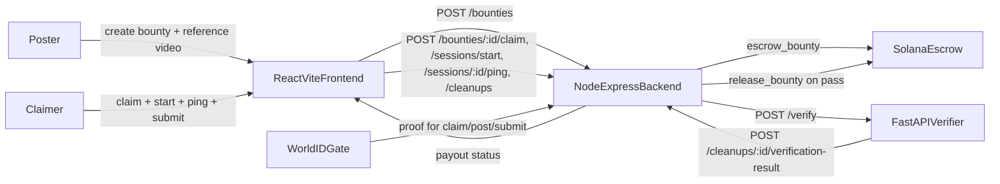
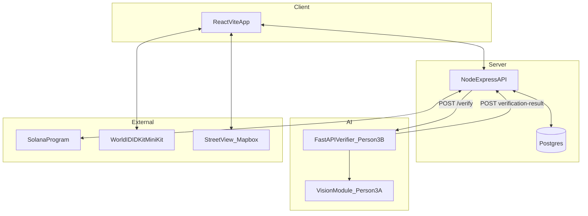
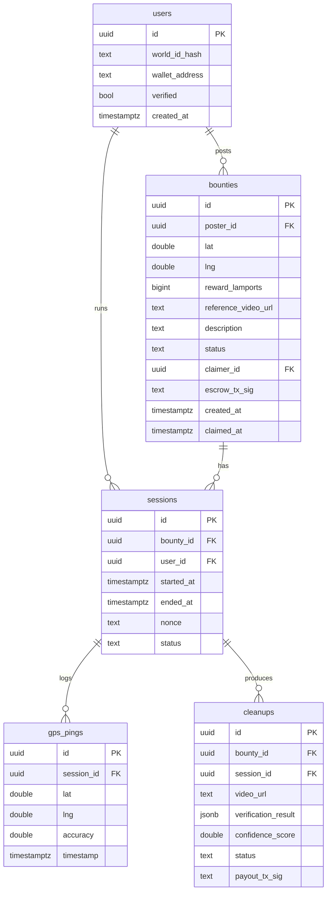

# Civic Bounty Marketplace — Full Design Specification

A geo-tagged civic-cleanup bounty marketplace. Organizations escrow Solana for cleanup work, anyone can claim and complete bounties, and AI verification releases instant payouts on completion.

**Hackathon tracks:** Sustain The Spark (environment) · World U (proof-of-human) · MLH Best Use of Solana

---

## 1. Thesis & value proposition

A bounty marketplace where organizations fund geo-tagged civic cleanup tasks (expandable to general service tasks later), anyone nearby can claim and complete them, and AI verifies the work before releasing instant Solana payouts.

We flip the gig economy toward social good: communities post the work, individuals earn micro-rewards for doing it, and Solana's near-zero fees make $5–$50 bounties economically viable for the first time. World ID guarantees one-human-one-account and AI verification removes the trust bottleneck, so funders know their money reaches real people doing real work.

## 2. Core features

- **Map-based bounty marketplace** — organizations drop a pin, record a reference 360 video, and escrow SOL/USDC; claimable bounties appear on a map filterable by reward, distance, and category.
- **One-tap task flow** — users press "Start Task" to begin a verified session, do the work, then record one 360 video at the end with a ghost-overlay matching the poster's framing.
- **Multi-layer verification** — continuous GPS trajectory, cell-tower cross-check, server-issued nonce watermark, and vision-model comparison against the poster's reference and Google Street View confirm both location and task completion.
- **World ID human gate** — every user verifies as a unique human before their first claim, blocking sockpuppet farming and giving funders confidence in the recipient.
- **Instant Solana payouts** — smart contract escrow releases the bounty the moment verification passes, with sub-cent fees that make small-dollar civic work actually pay.

---

## 3. End-to-end user flow

1. **Poster** drops a map pin, records a reference 360 video at the site, sets reward and description, escrows SOL into a smart contract.
2. **Claimer** browses the map, taps **Claim** on an open bounty (locks bounty for 4 hours).
3. **Claimer** travels to the location, taps **Start Task** — server issues a session token and a fresh nonce, app starts logging GPS every 10–15 s.
4. **Claimer** does the cleanup (phone in pocket is fine).
5. **Claimer** taps **Finish & Verify** — camera opens to a 360 capture UI with the poster's reference frame as a faded ghost overlay and the server nonce as a watermark.
6. **Claimer** records one 360 video and submits.
7. **Backend** queues the verification job and POSTs the bundle (videos, trajectory, nonce, duration) to the AI service.
8. **AI service** runs vision + fraud checks and posts a final result back.
9. **On pass:** smart contract releases SOL to the claimer's wallet; bounty marked completed; success toast in app.
10. **On fail:** bounty lock released and posted reason returned (claimer may retry; manual review queue is a stretch).



---

## 4. System architecture

| Layer | Stack | Owner |
|---|---|---|
| Frontend | React + Vite, Tailwind, React Router, Leaflet/Mapbox | Person 1 |
| Backend | Node + Express, Postgres (Supabase), Solana web3 SDK | Person 2 |
| Vision | Python, Claude vision API, ffmpeg/OpenCV | Person 3A |
| Verification service | Python FastAPI, async orchestration, fraud aggregator, callback client | Person 3B |
| Identity | World ID via MiniKit (preferred) or IDKit (fallback) | Person 4 |
| Design | Figma (component library + clickable prototype) | Person 4 |
| Payments | Solana (devnet for demo, mainnet-ready) | Person 2 |



---

## 5. Locked API contract (hour 1)

| Endpoint | Caller | Purpose |
|---|---|---|
| `POST /bounties` | FE → BE | Create bounty + escrow SOL |
| `GET /bounties` | FE → BE | List bounties for map (bounding-box filter) |
| `GET /bounties/:id` | FE → BE | Full bounty details |
| `POST /bounties/:id/claim` | FE → BE | Lock bounty to user (4h expiry) |
| `POST /sessions/start` | FE → BE | Begin task; server returns `session_id` + `nonce` |
| `POST /sessions/:id/ping` | FE → BE | GPS trajectory log (every 10–15 s) |
| `POST /cleanups` | FE → BE | Submit 360 video + session id |
| `POST /verify` | BE → AI | Run verification (async) |
| `POST /cleanups/:id/verification-result` | AI → BE | Final verification, triggers payout |
| `POST /users/verify` | FE → BE | Store World ID proof |

### Verification request (`POST /verify`)

```json
{
  "cleanup_id": "string",
  "submission_video_url": "https://...",
  "reference_video_url": "https://...",
  "bounty_lat": 34.0689,
  "bounty_lng": -118.4452,
  "gps_trajectory": [
    {"lat": 34.0689, "lng": -118.4452, "accuracy": 5, "timestamp": 1700000000}
  ],
  "issued_nonce": "string",
  "session_duration_s": 600
}
```

### Verification result (callback to backend)

```json
{
  "verified": true,
  "confidence": 0.91,
  "scene_match": true,
  "task_complete": true,
  "fraud_flags": [],
  "reasoning": "Scene and cleanup checks passed; no fraud indicators."
}
```

---

## 6. Database schema (Person 2)



`bounties.status ∈ {open, claimed, completed, expired}`. `sessions.status ∈ {active, ended, expired}`. `cleanups.status ∈ {pending, verified, rejected}`.

---

## 7. Person-by-person responsibilities

### Person 1 — Frontend (React + Vite)

**Owns:** all UI screens, routing, map, camera flow, bounty UI, profile.

| Task | Input | Output |
|---|---|---|
| Scaffold + design system | Figma tokens (Person 4) | React + Vite + Tailwind + Router; bottom nav and screen routing live |
| Map screen | `GET /bounties` | Interactive map; pins color-coded by status & reward; tap → site detail |
| Bounty posting flow | Lat/lng, description, reward, reference 360 video | `POST /bounties` with uploaded video URL; pin appears on map |
| Site detail page | `GET /bounties/:id` | Renders reference video, reward, description, claim button (gated by World ID) |
| Claim → cleanup flow | Successful claim | Start Task screen → `POST /sessions/start` then GPS pings every 10 s → Finish & Verify opens 360 camera with ghost overlay + nonce → uploads to `POST /cleanups` |
| Profile + leaderboard | `GET /users/:id`, `GET /leaderboard` | Completed bounties, total SOL earned, World ID verified badge; top earners with timeframe filter |
| Polish | — | Loading / error / empty states; payout success toast |

Routes (suggested): `/`, `/bounty/:id`, `/post`, `/session/:id`, `/verify/:id`, `/profile`, `/leaderboard`.

### Person 2 — Backend (API + Solana)

**Owns:** database, REST API, session/trajectory logging, Solana smart contract integration, payout logic.

- Implement all endpoints in §5 against the Postgres schema in §6.
- Solana integration: Anchor program (or direct SPL transfers for hackathon scope) with `escrow_bounty(amount, bounty_id)` and `release_bounty(bounty_id, recipient)`. Transaction signatures persisted on `bounties.escrow_tx_sig` and `cleanups.payout_tx_sig`.
- Trajectory analysis helper: given a `session_id`, return `{within_radius_pct, avg_distance_m, total_duration_s, suspicious}` — passed inside the `/verify` payload as part of `gps_trajectory` analysis context. (Helpful: `app/geo.py` in `ai-service/` provides reusable haversine helpers.)
- Devnet for demo; document mainnet migration path in the backend README.
- On `POST /cleanups/:id/verification-result` with `verified=true`, call `release_bounty` and mark `bounties.status = "completed"`. On `verified=false`, release the claim lock and surface `reasoning` to the claimer.

### Person 3A — Vision Analysis (Scene Match + Task Completion)

**Owns:** frame extraction, scene-match check, task-completion check.

- **Frame extraction utility:** download a video and extract 3–5 key frames (start/middle/end) via ffmpeg or OpenCV; return base64 strings ready for Claude vision.
- **Scene match check:** compare reference vs. submission frames for immutable structural features (buildings, road layout, signage); optionally fetch a Google Street View image at the bounty coordinates as a third reference. Strict JSON output.
- **Task completion check:** enumerate discrete trash items in the reference, then assess whether each is still present in the submission. Confidence = % of items resolved.
- Tune prompts on real test footage (night, partial cleanup, weather variation, similar-but-different locations).
- **Required handoff to Person 3B** (only coupling between 3A and 3B):

```python
async def check_scene_match(ref_url: str, sub_url: str, lat: float, lng: float) -> SceneMatchResult
async def check_task_complete(ref_url: str, sub_url: str) -> TaskCompleteResult
```

- **Optional handoff** that lights up extra fraud signals as soon as it's implemented (no Person 3B changes needed):

```python
async def extract_nonce_from_video(sub_url: str) -> str | None  # OCR the watermark
async def is_static_video(sub_url: str) -> bool
async def looks_like_replay(ref_url: str, sub_url: str) -> bool
```

These all live in `ai-service/app/vision.py`. Person 3B ships safe stubs so the rest of the service can be built independently.

### Person 3B — Verification Service (FastAPI infra + fraud + scoring)

**Owns:** FastAPI service, fraud aggregation, final scoring, async webhook callback to backend.

- Service: `ai-service/` (FastAPI, Pydantic v2, httpx, respx for tests).
- Endpoints: `GET /health`, `POST /verify` (returns `202 Accepted`, runs verification in `BackgroundTasks`).
- Calls Person 3A's two required functions concurrently with `asyncio.create_task` and runs the fraud aggregator alongside.
- **Fraud rules** (each appends a stable string to `fraud_flags`):
  - `session_too_short` — `session_duration_s < MIN_SESSION_DURATION_SECONDS` (default 120).
  - `no_gps_data` — empty trajectory.
  - `trajectory_outside_radius` — < 50% of pings within `BOUNTY_RADIUS_METERS` (default 75).
  - `nonce_mismatch` — only when `extract_nonce_from_video` returns a value AND it differs from issued nonce.
  - `static_frame_suspected` — when `is_static_video` returns True.
  - `replay_similarity_suspected` — when `looks_like_replay` returns True.
- **Final scoring:** `combined_confidence = 0.5 * scene + 0.5 * task`; `verified` requires combined > 0.85 AND scene match AND task complete AND no fraud flags.
- **Callback:** POSTs to `BACKEND_BASE_URL/cleanups/{id}/verification-result` with retries + exponential backoff (default 3 attempts, 1 s base, doubling). Optional bearer token from `BACKEND_INTERNAL_TOKEN`.
- Test coverage: 36 tests (geo, fraud, scoring, pipeline, callback, FastAPI). All green.
- Deployment: `Dockerfile` provided for Render / Fly / Railway.
- See `ai-service/ACTION_LOG.md` for the build log and `ai-service/README.md` for run instructions.

### Person 4 — World ID + Figma + Prompt support

**Owns:** World ID integration, full Figma design system, prompt-engineering support for Person 3A.

- **Figma design system (hours 1–3):** color palette, typography, button states, card components, map pin variants (open / claimed / completed / high-reward), nav, input states. Tokens documented and shared with Person 1.
- **World ID scaffolding (in parallel):** working test component in an isolated React route that triggers verification and returns a proof; documented integration steps for Person 1.
- **World ID integration:** verification gate component wrapping three actions:
  - Claiming a bounty
  - Submitting a cleanup
  - Posting a bounty

  On success, call `POST /users/verify` with the proof; backend stores `world_id_hash`. Display verified badge on profile.
- **Hour-1 decision:** **MiniKit** (World App Mini App, stronger track submission and distribution story) by default; **IDKit** (standalone web app) only as a fallback if Person 1 hits map/camera blockers inside the Mini App container.
- **Prompt support for Person 3A:** refine prompts for scene-match and task-complete; enforce strict JSON output schema; provide test cases for night videos, partial cleanups, weather variation.
- **Remaining Figma screens:** bounty detail, profile, leaderboard, post-bounty flow, payout success. Final clickable prototype for the demo walkthrough.

---

## 8. Repo layout

```
lahacks/
├── DESIGN_SPEC.md           <- this file
├── frontend/                <- Person 1 (React + Vite once migration begins)
├── backend/                 <- Person 2 (Node + Express + Postgres + Solana) [to be created]
└── ai-service/              <- Person 3B (FastAPI verification service) [present]
    └── ACTION_LOG.md        <- detailed build log for Person 3B
```

---

## 9. Risk register

| Risk | Mitigation |
|---|---|
| Solana program complexity | Start with simple SPL transfers + off-chain escrow tracking; full Anchor program is stretch |
| Vision verification inaccurate | Tune prompts on real footage early; confidence threshold + manual review queue as fallback |
| World ID Mini App constraints break map/camera UX | Hour-1 decision; fall back to IDKit + standalone web app if needed |
| 360 camera capture in browser | Test `getUserMedia` flow hour 1; fall back to standard wide-angle video |
| Frontend blocked on backend | Lock API contract hour 1; Person 1 mocks endpoints locally |
| AI service returns malformed JSON | Pydantic schema validation in Person 3B; strict system prompts in Person 3A |
| Backend webhook flaky | Person 3B retries with exponential backoff; loud logs on exhaustion (no silent loss) |

---

## 10. Demo script (target)

1. Show Figma flow on screen.
2. Poster posts a bounty in-app; reference video uploads; pin appears on map.
3. Claimer (second device) opens map, taps Claim, taps Start Task → GPS pings begin streaming to backend.
4. Claimer taps Finish & Verify → records short capture with nonce watermark visible.
5. Verification spinner → AI service callback fires within seconds → success toast → wallet balance updates on devnet.
6. Run a fail-path demo by pointing the submission to a `fail-task` URL; verification returns `verified=false` with human-readable `reasoning`.
